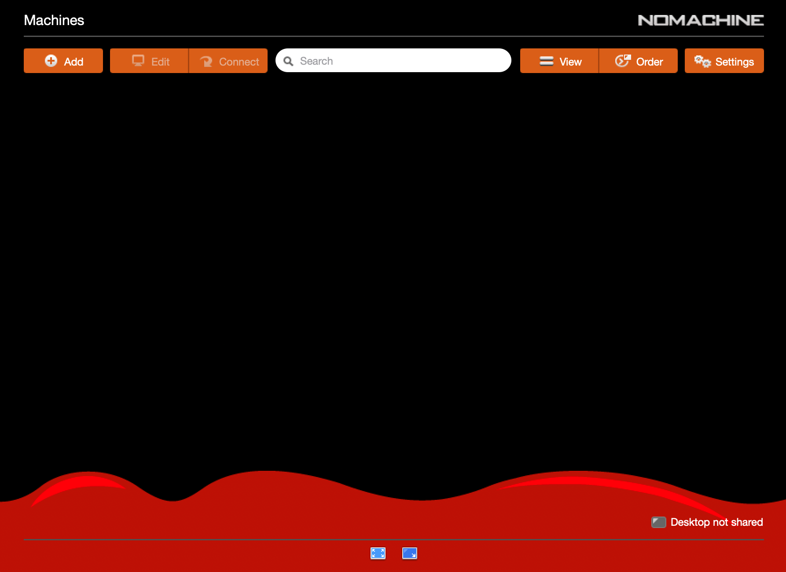
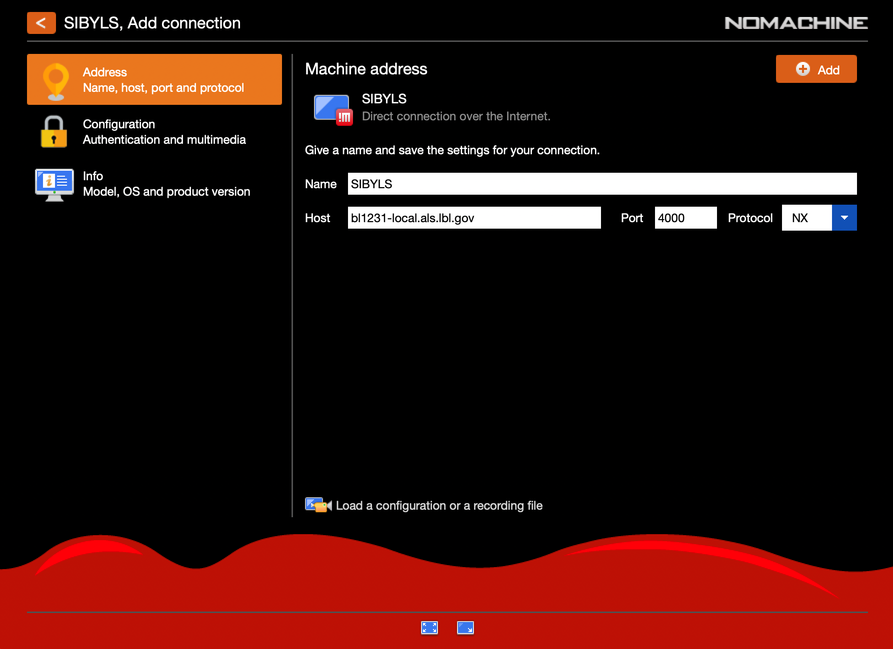
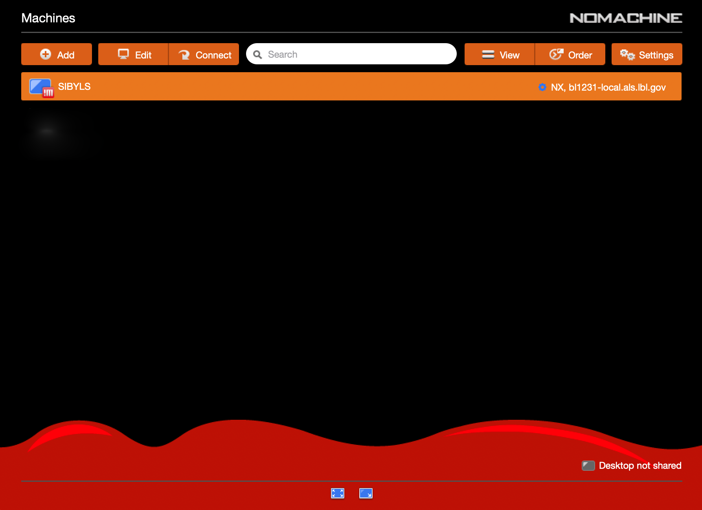
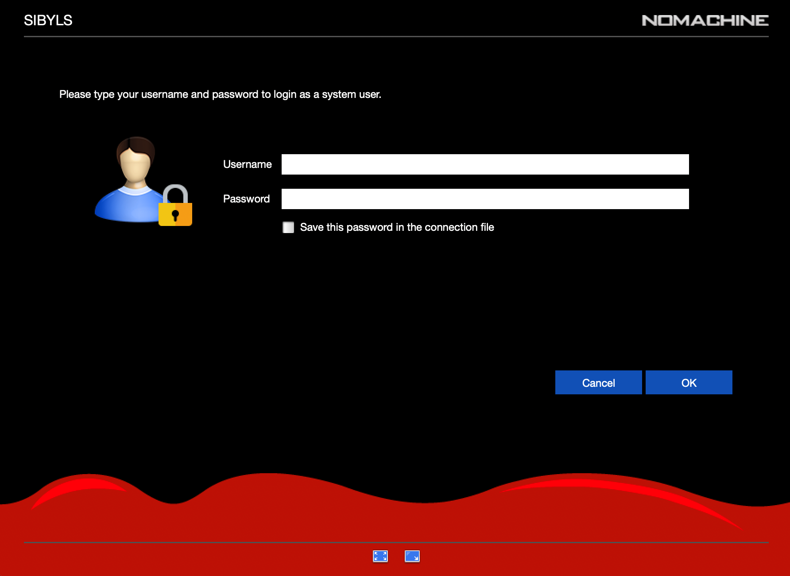
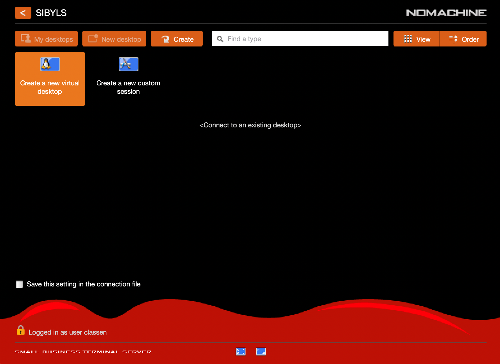
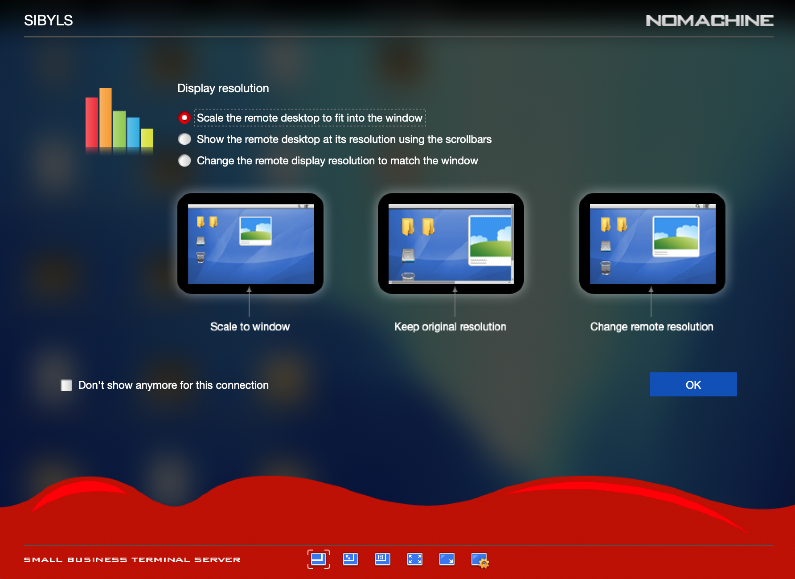
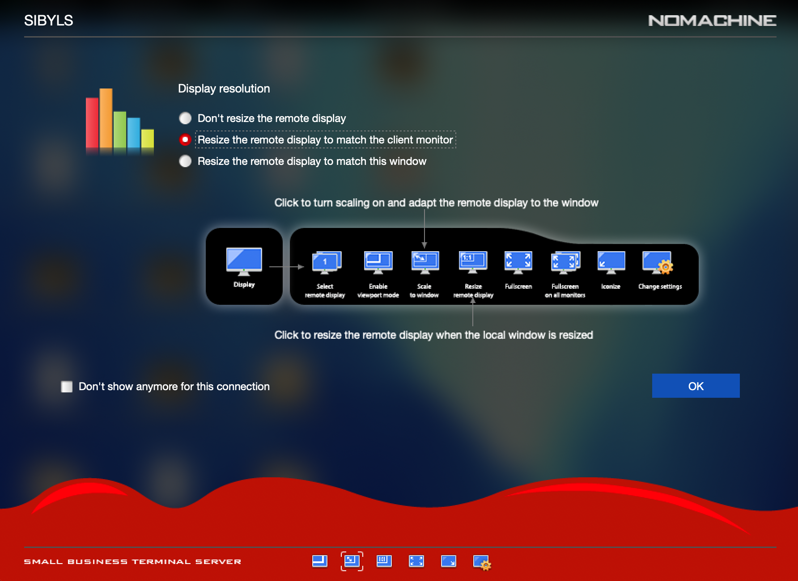
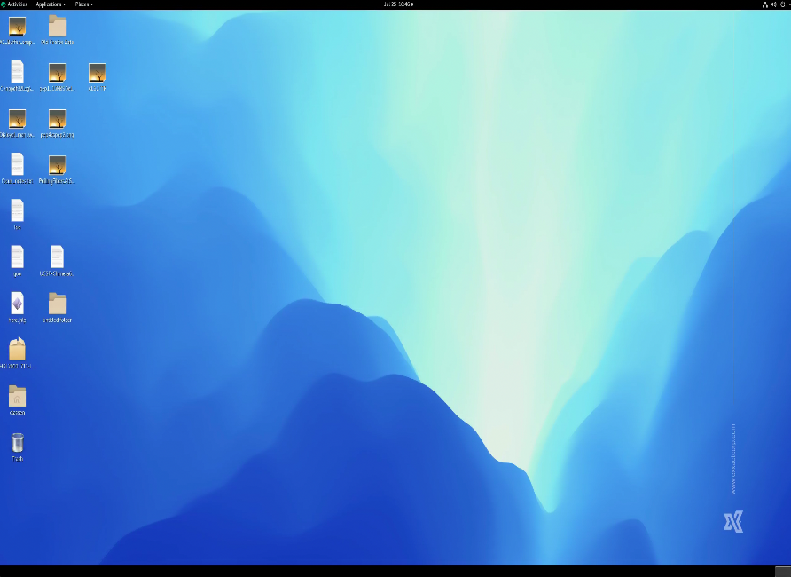

Connecting to Beamline Computers via NX
=======================================

Instructions for connecting to the beamline computers using NoMachine NX Client.

Install the NoMachine NX Client
-------------------------------

Download the `NX Client`_ for your Operating System, and follow their instructions for installation.

.. _NX Client: https://downloads.nomachine.com/

Configure a connection profile
------------------------------

1. Click the orange "Add" button in the upper left.

2. In the Machine Address section give your profile a name (e.g SIBYLS) and specify the FQDN of one of teh SIBYLS gateway machines ``bl1231-local.als.lbl.gov`` or ``kona.als.lbl.gov``. Leave the port set to ``4000`` and the Protocol set to ``NX``.

   When you are done, click the orange "Add" button in the upper right.

3. You should now have a new ``SIBYLS`` connection profile.

Connecting
----------

1. Select the ``SIBYLS`` profile and click the orange "Connect" button.

2. Enter your SIBYLS Computer Account username and password

3. Select the "Create a new virtual desktop" option and click the orange "Create" button.

4. Select the "Scale the remote desktop to fit into the window" option, and optionally check the box "Don't show anymore for this connection" if you don't want to be nagged every time you connect.

5. Select the "Resize the remote display to match the client monitor" option, and optionally check the box "Don't show anymore for this connection" if you don't want to be nagged every time you connect.

6. You should now have a full graphical Gnome desktop. Resize the NX Client window to amke maximum use of your computers monitor.

